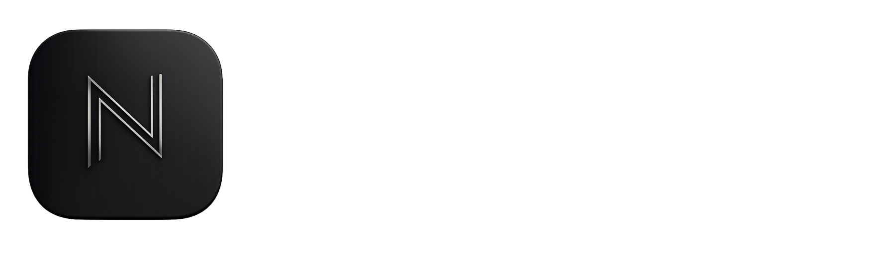

  <table>
    <tr>
      <td align="center" bgcolor="#101010">
        
      </td>
    </tr>
  </table>

  
<strong>VISÃO REGIONAL, IMPACTO GLOBAL.</strong>

  

    Tecnologia com direção para transformar necessidades reais em soluções digitais.
  

  

    <a href="#sobre">Sobre</a> ·
    <a href="#solucoes">Soluções</a> ·
    <a href="#projetos-e-site">Projetos</a> ·
    <a href="#equipe">Equipe</a>
  

---

## Sobre

A **Northeast Corp** desenvolve soluções digitais para empresas que precisam apresentar melhor seus serviços, organizar processos e evoluir sua operação com tecnologia.

Trabalhamos de forma próxima a cada cliente: entendemos o cenário, definimos o escopo, planejamos a solução, desenvolvemos, testamos e acompanhamos sua evolução.

Nossa atuação atual está concentrada em **software e produtos digitais**, com soluções pensadas para a necessidade e o contexto de cada negócio.

## Soluções

| Área | O que fazemos |
|---|---|
| **Sites e landing pages** | Criamos páginas institucionais e landing pages para apresentar empresas, serviços e campanhas. |
| **Sistemas web** | Desenvolvemos aplicações sob medida para apoiar processos e necessidades específicas do negócio. |
| **Painéis administrativos** | Criamos áreas de gestão para organizar informações, conteúdos e rotinas da operação. |
| **Automação de processos** | Identificamos tarefas que podem ser simplificadas com fluxos e ferramentas digitais. |
| **Manutenção e evolução** | Corrigimos, atualizamos e ampliamos soluções existentes conforme o escopo combinado. |
| **Sustentação recorrente** | Quando contratada, pode incluir hospedagem, monitoramento, backups, suporte e pequenas alterações dentro de um escopo definido. |

## Como trabalhamos

1. **Descoberta:** entendemos a necessidade e o contexto do projeto.
2. **Direção:** apresentamos um conceito inicial e alinhamos prioridades.
3. **Escopo:** definimos entregas, responsabilidades, prazo e investimento.
4. **Construção:** desenvolvemos a solução com revisões e testes internos.
5. **Validação e evolução:** entregamos para homologação e, quando contratado, seguimos com sustentação e melhorias.

## Projetos e site

Conheça o site institucional da Northeast Corp e confira nossos projetos, serviços e soluções digitais.

  <a href="https://northeastcorp.netlify.app"><strong>🌐 Acesse o site da Northeast Corp</strong></a>

> Confira também os repositórios públicos fixados no perfil da organização.

## Equipe

As fotos abaixo são carregadas diretamente dos perfis públicos do GitHub. Clique no nome para abrir o perfil; os links do LinkedIn aparecem logo abaixo de cada pessoa.

<table>
  <tr>
    <td align="center" valign="top" width="33%">
      <a href="https://github.com/Pedro-hxm">
         
        <strong>Pedro Henrique Paiva Barros</strong>
      </a> 
      Sócio fundador CEO 
      <a href="https://github.com/Pedro-hxm">GitHub</a> ·
      <a href="https://www.linkedin.com/in/pedro-henrique-198a81306/">LinkedIn</a>
    </td>
    <td align="center" valign="top" width="33%">
      <a href="https://github.com/GuiCodeLabs">
         
        <strong>Guilherme Cavalcante Beserra</strong>
      </a> 
      Sócio fundador Diretor de Software 
      <a href="https://github.com/GuiCodeLabs">GitHub</a> ·
      <a href="https://www.linkedin.com/in/guicodelabs">LinkedIn</a>
    </td>
    <td align="center" valign="top" width="33%">
      <a href="https://github.com/devgeordane">
         
        <strong>Vitor Geordane de Araújo</strong>
      </a> 
      Sócio fundador Diretor Comercial e de Marketing 
      <a href="https://github.com/devgeordane">GitHub</a> ·
      <a href="https://www.linkedin.com/in/vitor-geordane-7a5a73322">LinkedIn</a>
    </td>
  </tr>
  <tr>
    <td align="center" valign="top" width="33%">
      <a href="https://github.com/Pedro-Brazz">
         
        <strong>Pedro Antonio Braz da Silva</strong>
      </a> 
      Desenvolvedor de Software 
      <a href="https://github.com/Pedro-Brazz">GitHub</a> ·
      <a href="https://www.linkedin.com/in/pedro-braz-706540300/">LinkedIn</a>
    </td>
    <td align="center" valign="top" width="33%">
      <a href="https://github.com/LanNunez">
         
        <strong>Arllan Leopoldino Nunes</strong>
      </a> 
      Desenvolvedor de Software 
      <a href="https://github.com/LanNunez">GitHub</a> ·
      <a href="https://www.linkedin.com/in/arllan-leopoldino-68799635b/">LinkedIn</a>
    </td>
    <td width="33%"></td>
  </tr>
</table>

## O que orienta nosso trabalho

- **Clareza:** comunicação direta e entregas bem definidas.
- **Tecnologia aplicada:** escolhas técnicas ligadas a necessidades reais.
- **Responsabilidade:** escopo, prazos e capacidade de entrega alinhados desde o início.
- **Evolução contínua:** soluções preparadas para receber melhorias com o crescimento do negócio.

---

  <strong>NORTHEAST CORP</strong> · Visão regional, impacto global.

<!--
O endereço público do site e a inclusão de outras pessoas no mural devem ser confirmados antes da publicação.
-->
